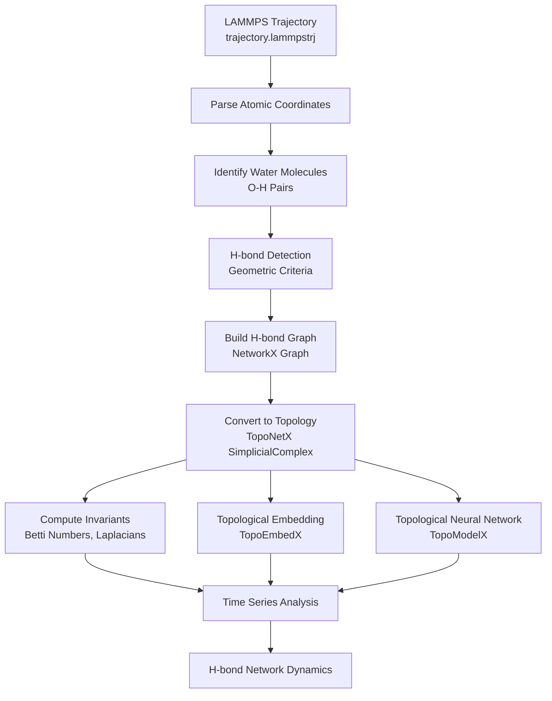

# Hydrogen Bond Network Topology Analysis

[](https://github.com/ResearchGeekSQ/topoHBNet/actions/workflows/test.yml)
[](https://www.python.org/downloads/)
[](https://opensource.org/licenses/MIT)

Analyze hydrogen bond (H-bond) network topology from LAMMPS molecular dynamics trajectories using the **TopoX Suite** (TopoNetX, TopoModelX, TopoEmbedX).

## Overview

This package provides topological data analysis tools for studying the dynamics of hydrogen bond networks in water and aqueous systems.

### TopoX Library Roles

| Library | Function | Application in H-bond Analysis |
|---------|----------|-------------------------------|
| **TopoNetX** | Topological data structures (SimplicialComplex, CellComplex) | Build topological representation of H-bond networks |
| **TopoModelX** | Topological Neural Networks (TNN) | Learn dynamic features of H-bond networks |
| **TopoEmbedX** | Topological embedding algorithms (Cell2Vec, HOPE) | Generate low-dimensional representations |

---

## Workflow



---

## Installation

### Prerequisites: Install uv (Recommended)

[uv](https://github.com/astral-sh/uv) is a fast Python package manager (10-100x faster than pip).

```bash
# Install uv (Windows PowerShell)
powershell -c "irm https://astral.sh/uv/install.ps1 | iex"

# Or via pip
pip install uv
```

### Step 1: Install PyTorch with CUDA (for RTX 5080 / Blackwell GPUs)

```bash
# Using uv (recommended)
uv pip install torch torchvision torchaudio --index-url https://download.pytorch.org/whl/cu129
uv pip install torch-scatter torch-sparse --find-links https://data.pyg.org/whl/torch-2.5.1+cu129.html

# Or using pip
pip install torch torchvision torchaudio --index-url https://download.pytorch.org/whl/cu129
pip install torch-scatter torch-sparse -f https://data.pyg.org/whl/torch-2.5.1+cu129.html
```

### Step 2: Install the Package

```bash
cd path/to/4.Topology_HBN

# Using uv (recommended)
uv pip install -e .                    # Core only
uv pip install -e ".[embedding]"       # + Cell2Vec, HOPE
uv pip install -e ".[learning]"        # + TopoModelX
uv pip install -e ".[persistence]"     # + gudhi
uv pip install -e ".[all]"             # All features

# Or using pip
pip install -e ".[all]"
```

---

## Quick Start

### Command Line

```bash
python run_analysis.py trajectory.lammpstrj --output results/
```

### Python API

```python
from hbond_topology import (
    TrajectoryParser,
    HBondDetector,
    HBondComplexBuilder,
    TopologicalInvariants,
    DynamicsAnalyzer,
    TopologyVisualizer
)

# Load trajectory
parser = TrajectoryParser("trajectory.lammpstrj")
frames = parser.parse()

# Analyze a single frame
detector = HBondDetector()
hbonds = detector.detect_hbonds(frames[0])

# Build simplicial complex
builder = HBondComplexBuilder()
sc = builder.build_from_frame(frames[0], hbonds)

# Compute topological invariants
invariants = TopologicalInvariants()
result = invariants.compute_all_invariants(sc)
print(f"Betti numbers: {result['betti_numbers']}")

# Full trajectory analysis
analyzer = DynamicsAnalyzer()
results = analyzer.analyze_trajectory(parser)

# Visualize
viz = TopologyVisualizer()
viz.plot_dynamics(results, save_path="dynamics.png")
```

---

## Topological Representation

### Simplicial Complex Structure

- **0-simplices (nodes)**: Water molecules (oxygen atoms)
- **1-simplices (edges)**: Hydrogen bonds
- **2-simplices (triangles)**: Three-water H-bond rings

### Computed Invariants

| Invariant | Symbol | Physical Meaning |
|-----------|--------|------------------|
| Betti-0 | β₀ | Number of connected components |
| Betti-1 | β₁ | Number of loops/holes |
| Betti-2 | β₂ | Number of voids/cavities |
| Euler Characteristic | χ | V - E + F |
| Hodge Laplacian | L₀, L₁ | Connectivity at each rank |

---

## H-bond Detection Criteria

Default geometric criteria:

| Parameter | Default | Description |
|-----------|---------|-------------|
| D-A distance | < 3.5 Å | Donor oxygen to acceptor oxygen |
| H-A distance | < 2.5 Å | Hydrogen to acceptor oxygen |
| D-H-A angle | > 120° | Angle at hydrogen |

Customize via:
```bash
python run_analysis.py trajectory.lammpstrj \
    --r-da-max 3.5 \
    --r-ha-max 2.5 \
    --angle-min 120
```

---

## Project Structure

```
hbond_topology/
├── io/
│   └── trajectory_parser.py    # LAMMPS trajectory parsing
├── detection/
│   └── hbond_detector.py       # H-bond detection with PBC
├── topology/
│   ├── complex_builder.py      # TopoNetX construction
│   └── invariants.py           # Topological invariants
├── embedding/
│   └── embedder.py             # TopoEmbedX (Cell2Vec, HOPE)
└── analysis/
    ├── dynamics.py             # Trajectory analysis
    └── visualization.py        # Plotting
```

---

## Output

| File | Description |
|------|-------------|
| `analysis_results.json` | Full results for each frame |
| `statistics.json` | Summary statistics |
| `topology_dynamics.png` | Betti numbers, H-bonds over time |
| `hbond_statistics.png` | Distance and angle evolution |
| `statistics_summary.png` | Property distributions |

---

## Advanced Usage

### Topological Embedding

```python
from hbond_topology.embedding import HBondEmbedder

embedder = HBondEmbedder(method='cell2vec', dimensions=32)
embedding = embedder.fit_transform(sc)
```

### Persistence Homology (with gudhi)

```python
import gudhi

rips = gudhi.RipsComplex(points=positions, max_edge_length=3.5)
persistence = rips.create_simplex_tree().persistence()
```

---

## Technical Notes

> **Periodic Boundary Conditions**: H-bond detection uses minimum image convention for PBC-aware distance calculations.

> **Large Trajectories**: For long trajectories, consider batch processing with `--start`, `--stop`, `--step` flags.

> **GPU Acceleration**: TopoModelX uses PyTorch for GPU-accelerated topological neural networks.

---

## References

1. Hajij et al. 2023. [TopoX: A Suite of Python Packages for Machine Learning on Topological Domains](https://arxiv.org/abs/2402.02441)
2. Papillon et al. 2023. [Architectures of Topological Deep Learning: A Survey on Topological Neural Networks](https://arxiv.org/abs/2304.10031)
3. Hajij et al. 2023. [Topological Deep Learning: Going Beyond Graph Data](https://arxiv.org/abs/2206.00606)
